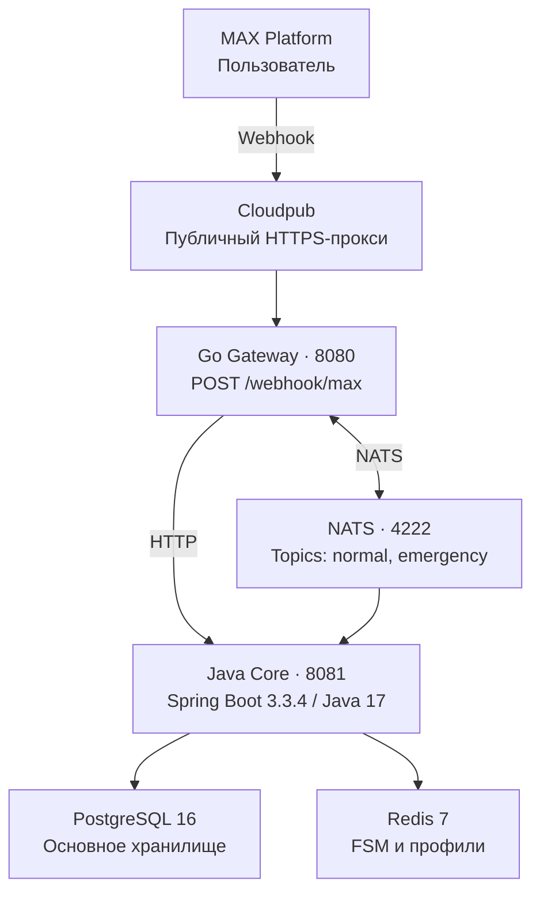

# Дом в Порядке

**Чат-бот в MAX для управления домом**

Поиск управляющей компании по адресу, аварийные обращения, заявки на мастера и история заявок в одном чат-боте.

### ⚡ Технологии


| Параметр | Значение |
|---|---|
| Трек | Умный город |
| Организаторы | Минобрнауки + MAX |
| Дедлайн | 29 сентября 2026 |
| Версия | `1.0.0` |
| Commit | `a1163a1ef2b101f9b0bb8def2cd8fab623aa266f` |
| Репозиторий | [winlu2303/hackathon-max-2026](https://github.com/winlu2303/hackathon-max-2026) |
| Бот в MAX | `t443_hakaton_max_bot` |
| ID бота | `390227571` |

> **Статус MVP.** Реальные интеграции с управляющими компаниями отсутствуют. Справочник содержит 25 224 тестовые записи об УК. Сообщения интерфейса об отправке обращения не подтверждают его фактическую доставку в УК. Подробности — в разделах [«Тестовые данные»](#9-тестовые-данные) и [«Известные ограничения»](#13-известные-ограничения).

## Содержание

1. [Назначение решения](#1-назначение-решения)
2. [Основной пользовательский сценарий](#2-основной-пользовательский-сценарий)
3. [Состав и архитектура](#3-состав-и-архитектура)
4. [Запуск всех компонентов](#4-запуск-всех-компонентов)
5. [Параметры окружения и переменные](#5-параметры-окружения-и-переменные)
6. [Зависимости](#6-зависимости)
7. [Внешние сервисы и интеграции](#7-внешние-сервисы-и-интеграции)
8. [Работа с данными](#8-работа-с-данными)
9. [Тестовые данные](#9-тестовые-данные)
10. [Пошаговый сценарий проверки](#10-пошаговый-сценарий-проверки)
11. [Ожидаемое поведение](#11-ожидаемое-поведение)
12. [Использование возможностей MAX сверх минимума](#12-использование-возможностей-max-сверх-минимума)
13. [Известные ограничения](#13-известные-ограничения)
14. [Масштабирование](#14-масштабирование)
15. [Порядок остановки и повторного запуска](#15-порядок-остановки-и-повторного-запуска)
16. [Собственный API](#16-собственный-api)
17. [Контакты команды](#17-контакты-команды)

---

## 1. Назначение решения

Жильцы многоквартирных домов и частного сектора тратят время на поиск своей управляющей компании, не знают, кого вызывать при аварии, и не могут отследить статус обращения.

**«Дом в Порядке»** — чат-бот в MAX, который помогает пройти путь от адреса до зарегистрированной заявки:

- определяет УК по адресу;
- оформляет аварийную заявку или заявку на мастера;
- показывает контакты диспетчеров и управляющей компании;
- позволяет просматривать заявки и отмечать их завершение;
- ежемесячно напоминает о возможности вызвать мастера при неактивности пользователя 30 дней и более.

**Основная ценность:** сократить путь от бытовой проблемы — потопа, отсутствия света или сломанного крана — до оформления обращения для УК.

**Целевой ориентир команды:** пройти путь от адреса до заявки за 30 секунд. Это ориентир, а не подтверждённый результат измерений.

## 2. Основной пользовательский сценарий

### Текущий процесс — As Is

- Жилец ищет УК по адресу в интернете или на квитанции.
- Звонит в диспетчерскую и может не дозвониться.
- Не знает номер аварийной службы при утечке газа.
- Не видит понятного статуса заявки.

### Сценарий в боте — To Be

1. Жилец открывает бота `t443_hakaton_max_bot` в MAX и отправляет `/start`.
2. Выбирает роль: собственник или арендатор.
3. Вводит адрес — город, улицу и дом — и подтверждает его.
4. Бот находит УК по адресу. Жилец выбирает организацию из списка.
5. Бот сохраняет профиль и открывает главное меню.

### Сквозной сценарий «Авария»

1. Жилец выбирает **«🚨 АВАРИЯ»**, указывает квартиру и категорию, например **«💨 Утечка газа»**.
2. Бот создаёт заявку и показывает карточку с контактами диспетчеров: **«Диспетчер газа: 04 / 104»**, **«Служба спасения: 112»**. В сценарии доступны кнопки **«📤 Отправить заявку в УК»** и **«✅ Пропустить имя»**.
3. Жилец вводит имя или пропускает этот шаг. Интерфейс показывает сообщение: **«Заявка отправлена в УК»**.
4. Бот возвращает пользователя в главное меню.

> В текущем MVP сообщение об отправке является частью демонстрационного сценария. Реальная передача заявки диспетчеру УК не подключена. На финальном этапе возможно подключение интеграции, если команда получит необходимые ключи и доступ.

### Просмотр и завершение заявок

- **«📋 Мои активные заявки»** — карточки с УК, статусом и кнопкой **«✅ Завершить аварию #N»**.
- После подтверждения заявка получает статус `CLOSED`, а поле `closed_at` — текущее время (`now()`).
- **«📊 Статус всех заявок»** — список заявок с отметками ✅ / ⭕.

### Частный сектор

- Если по адресу не найдены УК, бот предлагает кнопку **«🏘️ Частный сектор»**.
- Профиль сохраняется без привязанной УК.
- В сценариях аварии и вызова мастера бот не запрашивает квартиру.
- При попытке подать жалобу бот сообщает: **«У вас не привязана УК (частный сектор)»**.

## 3. Состав и архитектура



**Основные компоненты Java Core:**

- `MessageHandler` — FSM-логика диалога;
- `EmergencyService` — аварийные заявки;
- `ServiceRequestService` — заявки на мастера;
- `MaxUserService` — пользователи MAX;
- `MonthlyPingService` — ежемесячные напоминания;
- REST API — `/api/v1/*`.

| Компонент | Роль | Порт |
|---|---|---|
| Go Gateway | Принимает webhook от MAX, публикует события в NATS | `8080` |
| Java Core | FSM-логика бота, работа с БД, REST API | `8081` |
| PostgreSQL 16 | Основное хранилище: заявки, УК, пользователи | `5432` |
| Redis 7 | FSM-состояния и профили чатов | `6379` |
| NATS 2.10 | Шина событий между Gateway и Core | `4222` |
| Cloudpub | Публичный HTTPS-туннель к webhook | — |
| MAX Platform | Внешний сервис: бот-платформа | — |

## 4. Запуск всех компонентов

Перед запуском создайте файл `.env` по инструкции в [разделе 5](#5-параметры-окружения-и-переменные).

### Запуск одной командой

```bash
docker compose up -d --build
```

### Проверка состояния

```bash
docker compose ps
curl -s http://localhost:8081/api/v1/health
```

Ожидаемый ответ API:

```json
{"status":"ok"}
```

### Время сборки

Требование хакатона — не более 5 минут. Ниже приведены результаты замеров команды.

| Сценарий | Время |
|---|---|
| Первая сборка с пустым Docker-кэшем | 4 мин 28 сек |
| Повторная сборка с кэшем | Около 30 сек |

Основное время занимает `mvn dependency:go-offline`: скачивание зависимостей Maven — 242 секунды при первоначальной загрузке.

### Пересборка с полным сбросом

> Команда удаляет тома Docker Compose, включая сохранённые данные БД и Redis.

```bash
docker compose down -v
docker compose up -d --build
```

### Остановка с сохранением данных

```bash
docker compose down
```

### Остановка с удалением данных

```bash
docker compose down -v
```

## 5. Параметры окружения и переменные

Создайте `.env` рядом с `docker-compose.yml`, используя `.env.example`:

```dotenv
MAX_BOT_TOKEN=<bot token from MAX>
MAX_API_URL=https://platform-api2.max.ru
DB_NAME=dom_v_poryadke
DB_USER=dom_user
DB_PASSWORD=change_me
```

| Переменная | Назначение |
|---|---|
| `MAX_BOT_TOKEN` | Токен бота MAX |
| `MAX_API_URL` | Базовый адрес API MAX |
| `DB_NAME` | Имя базы данных |
| `DB_USER` | Пользователь базы данных |
| `DB_PASSWORD` | Пароль базы данных; замените пример своим значением |

### Используемые порты

| Порт | Компонент |
|---|---|
| `8080` | Go Gateway |
| `8081` | Java Core |
| `5432` | PostgreSQL |
| `6379` | Redis |
| `4222` | NATS |

## 6. Зависимости

### Java — `java-core/pom.xml`

- Spring Boot 3.3.4;
- Java 17;
- PostgreSQL driver;
- Flyway 10;
- Lombok;
- Jackson;
- NATS client;
- Lettuce — Redis.

### Go — `go-gateway/go.mod` и `go.sum`

- `nats.go`;
- стандартная библиотека HTTP.

### Python — `requirements.txt`

| Пакет | Назначение |
|---|---|
| `openpyxl` | Генерация миграции V4 из Excel |
| `jsonschema` | Валидация DATA-API |
| `pyyaml` | Работа с YAML при валидации DATA-API |

### Frontend — `mini-app/package.json`

Мини-приложение MAX оставлено как заготовка для будущей разработки. В основном пользовательском сценарии и проверке MVP не участвует.

## 7. Внешние сервисы и интеграции

| Сервис | Назначение | Условия работы |
|---|---|---|
| MAX Platform — `platform-api2.max.ru` | Чат-бот, inline-кнопки, webhook | Требуется токен бота |
| Cloudpub | HTTPS-прокси для webhook | Требуется публичный URL |
| PostgreSQL | Хранилище | Запускается в Docker |
| Redis | FSM-состояния | Запускается в Docker |
| NATS | Шина событий | Запускается в Docker |

**Реальные интеграции с УК отсутствуют.** Справочник из 25 224 записей об УК подготовлен для тестирования на основе открытого примера реестра. Подробнее — в [разделе 9](#9-тестовые-данные).

Для промышленной версии планируется подключение [ГИС ЖКХ](https://dom.gosuslugi.ru).

## 8. Работа с данными

### PostgreSQL — основное хранилище

| Миграция | Данные и изменения |
|---|---|
| V1 | `buildings`, `users`, `emergency_alerts`, `service_requests` |
| V2–V4 | `management_companies` — 25 224 записи |
| V3 | `max_users` |
| V5 | Статусы заявок и поле `closed_at` |
| V6 | Поле `uk_id` в заявках |
| V7 | Поле `last_ping_at` |

### Redis — состояния диалогов и профили

| Ключ | Назначение |
|---|---|
| `fsm:state:{chatId}` | Текущее состояние диалога |
| `fsm:temp:{chatId}` | Временные поля: адрес, квартира, flow |
| `fsm:last:{chatId}` | Последний ID заявки |
| `profile:{chatId}` | Сохранённый профиль пользователя |

## 9. Тестовые данные

**Файл миграции:**

```text
java-core/src/main/resources/db/migration/V4__seed_management_companies.sql
```

Миграция содержит 25 224 записи об УК и сгенерирована из файла:

```text
documentation/Управляющие компании. Пример.xlsx
```

Данные обезличены и предназначены для демонстрации. Они не подтверждают реальное подключение управляющих компаний к сервису.

### Адреса для проверки поиска УК

- `Великий Новгород Ломоносова 12`
- `Москва Арбат 68`
- `Ижевск Ленина 90`

### Адрес для проверки частного сектора

Используйте адрес, которого нет в справочнике:

```text
деревня Гадюкино
```

**Тестовые данные для API:** `docs/test-data.json`.

## 10. Пошаговый сценарий проверки

| Шаг | Действие | Ожидаемый результат |
|---|---|---|
| 1 | Откройте `t443_hakaton_max_bot` в MAX и отправьте `/start` | Бот начинает сценарий регистрации |
| 2 | Выберите **«🏠 Я собственник»** | Бот запрашивает адрес |
| 3 | Введите **«Ижевск Ленина 90»** и нажмите **«✅ Да, верно»** | Бот предлагает найденные УК |
| 4 | Выберите УК из списка | Профиль сохраняется, открывается главное меню |
| 5 | Выберите **«🚨 АВАРИЯ»**, введите квартиру `78`, выберите **«💨 Утечка газа»** | Бот создаёт аварийную заявку |
| 6 | Проверьте ответ бота | Показаны контакты диспетчера газа и службы спасения `112` |
| 7 | Введите имя **«Софья»** или нажмите **«Пропустить»** | Бот завершает оформление и возвращает меню |
| 8 | Откройте **«📋 Мои активные заявки»** | В карточке указана УК, выбранная при регистрации |
| 9 | Нажмите **«✅ Завершить аварию #N»**, затем **«✅ Да, завершить»** | Появляется сообщение **«Заявка #N завершена»** |
| 10 | Откройте **«📊 Статус всех заявок»** | Завершённая заявка отмечена ✅ |
| 11 | Выберите **«🔄 Начать заново»**, укажите **«деревня Гадюкино»**, нажмите **«🏘️ Частный сектор»** | Профиль сохраняется без УК |
| 12 | Выберите **«🚨 АВАРИЯ»** | Сразу открывается список категорий, без запроса квартиры |
| 13 | Выберите **«📝 Подать жалобу в управляющую компанию»** и введите текст | Бот сообщает, что УК не привязана: частный сектор |

## 11. Ожидаемое поведение

- Все тексты интерфейса — на русском языке.
- Inline-кнопки располагаются в одну или две колонки.
- При аварии бот показывает карточку диспетчера и кнопки действий.
- Команда `/start` в любой момент возвращает пользователя в главное меню согласно описанию команды.
- УК в карточке заявки совпадает с УК, выбранной при регистрации на момент создания заявки.
- Ошибки обрабатываются через `try/catch`; предусмотрен ответ: **«Не понял команду. /start»**.

## 12. Использование возможностей MAX сверх минимума

Команда выделяет следующие возможности реализации. Их наличие само по себе не гарантирует платформенный бонус: оценка зависит от критериев хакатона.

| Возможность | Реализация |
|---|---|
| Inline-клавиатуры | Навигация построена на кнопках. В основных сценариях текстовый ввод нужен для адреса, квартиры и имени |
| Двухрядная раскладка | Массивы массивов кнопок формируют раскладку меню |
| FSM-диалог | Многошаговые сценарии с сохранением состояния в Redis: регистрация из пяти шагов, авария из трёх |
| Проактивные уведомления | `MonthlyPingService` раз в месяц пишет пользователю при неактивности 30 дней и более |
| Callback-кнопки с payload | Динамические идентификаторы: `close_emergency_{id}`, `confirm_close_master_{id}`, `uk_{id}`, `role_owner`, `private_sector` |
| Персональная карточка | Заявка содержит адрес пользователя, выбранную УК и телефон |
| Просмотр статусов | Пользователь видит список заявок с отметками ✅ / ⭕ и может завершить заявку с подтверждением |

> Просмотр статусов в меню не означает автоматическую push-рассылку при каждой смене статуса.

## 13. Известные ограничения

1. **Нет реальной интеграции с УК.** Используются тестовые данные, описанные в [разделе 9](#9-тестовые-данные).
2. **Нет автоматической смены рабочих статусов.** Статусы `SENT_TO_UK`, `IN_PROGRESS` и `PENDING_CONFIRM` диспетчер УК должен выставлять через REST API.
3. **Жалоба в УК — заглушка.** Бот показывает сообщение пользователю, но не отправляет жалобу в реальную организацию.
4. **Нет отдельного экрана архива.** Закрытые заявки доступны через **«📊 Статус всех заявок»**.
5. **Cloudpub используется как публичный туннель.** Решение не рассчитано на промышленную эксплуатацию; соединение может прерываться при длительной неактивности.
6. **Используется один бот** — `t443_hakaton_max_bot`. Поддержка multi-tenancy отсутствует.
7. **Часовой пояс зависит от системы.** В описанной конфигурации используется MSK.
8. **Заготовки интерфейса не входят в основной сценарий.** `mini-app/` и `java-core/src/max-ui.jsx` оставлены для дальнейшей разработки.

## 14. Масштабирование

Для переноса решения в новый регион, город или УК адаптируются данные и поиск организации.

| Меняется | Сохраняется |
|---|---|
| Справочник `management_companies`: новая миграция вида `V4__seed_*.sql` для новой базы | FSM-сценарии |
| Правило поиска УК: `ManagementCompanyRepository.searchByAddressTokens(...)` | Интеграция с MAX |
| Параметры подключения | Docker-стек |
| Токен бота для отдельного развёртывания | Схема БД |

### Точки расширения

- `ManagementCompanyRepository` — источник данных об УК.
- `application.yml` — параметры подключения.
- `.env` — токен бота; предполагается отдельный бот на регион.

Для уже развёрнутой базы изменения следует оформлять новой версией миграции, не изменяя применённую V4.

## 15. Порядок остановки и повторного запуска

### Остановить с сохранением данных

```bash
docker compose down
```

### Запустить повторно

```bash
docker compose up -d
```

### Полностью сбросить демонстрационное окружение

> Следующая последовательность удаляет все данные в томах Docker Compose.

```bash
docker compose down -v
docker compose up -d --build
```

### Пересобрать Java Core после изменений кода

```bash
docker compose build --no-cache java-core
docker compose up -d
```

### Изменения миграций V1–V4

Flyway проверяет контрольные суммы уже применённых миграций. Если изменить V1–V4 в демонстрационном окружении, повторный запуск потребует сброса базы через `docker compose down -v`, что удалит данные.

Для сохранения существующих данных используйте новую миграцию вместо изменения уже применённых файлов.

## 16. Собственный API

**Базовый адрес:** [https://neutrally-balmy-scallop.cloudpub.ru/api/v1/](https://neutrally-balmy-scallop.cloudpub.ru/api/v1/)

| Материал | Путь |
|---|---|
| OpenAPI-спецификация | `docs/openapi.yaml` |
| DATA-API | `docs/DATA-API.yaml` |
| Тестовые данные | `docs/test-data.json` |

### Обязательные эндпоинты

В таблице указаны полные пути от корня хоста.

| Метод | Путь | Назначение |
|---|---|---|
| `GET` | `/api/v1/health` | Проверка работоспособности |
| `POST` | `/api/v1/emergency` | Создать аварийную заявку |
| `GET` | `/api/v1/emergency/{id}` | Получить аварийную заявку |
| `POST` | `/api/v1/emergency/{id}/ack` | Подтвердить аварийную заявку |
| `DELETE` | `/api/v1/emergency/{id}` | Удалить аварийную заявку |
| `POST` | `/api/v1/requests` | Создать заявку на мастера |
| `GET` | `/api/v1/requests/{id}` | Получить заявку на мастера |
| `GET` | `/api/v1/buildings` | Получить список домов |
| `GET` | `/api/v1/ping/trigger` | Вручную запустить тестовое уведомление |

**Тестовые учётные записи:** не требуются; API открыт для проверки согласно конфигурации MVP.

## 17. Контакты команды

**Команда «Дом в Порядке»**

| Участник | Роль | GitHub |
|---|---|---|
| Винтер София-Луна | Fullstack-разработчик | [winlu2303](https://github.com/winlu2303) |
| Магомедов Надир | Project-менеджер | — |
| Стаценко Иван | Backend-разработчик | [beinaction](https://github.com/beinaction) |

- **Репозиторий:** [winlu2303/hackathon-max-2026](https://github.com/winlu2303/hackathon-max-2026).
- **Бот в MAX:** `t443_hakaton_max_bot`.
- **ID бота:** `390227571`.
